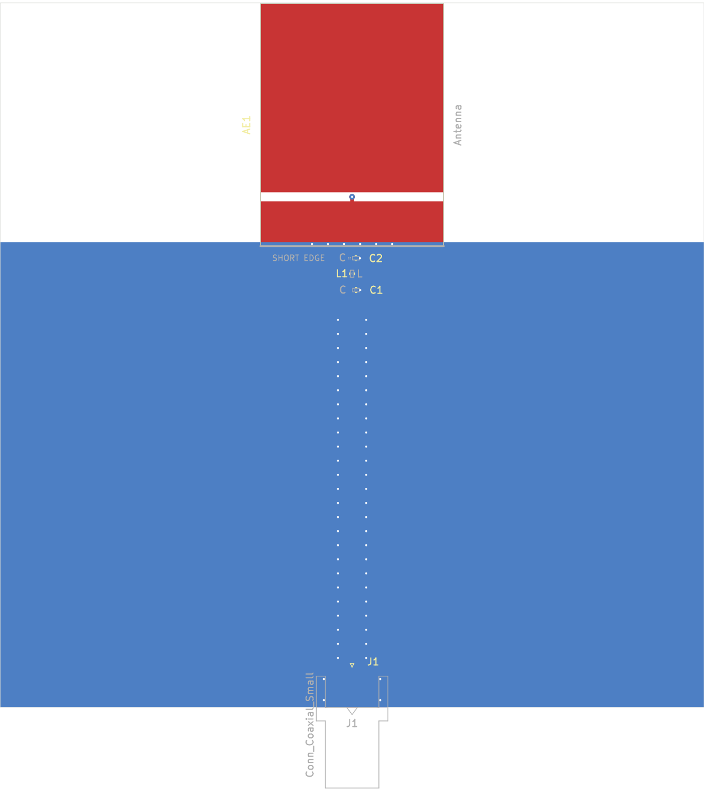

# PIFA 915 MHz Antenna - Simulation Verification Report

Shorted-patch Planar Inverted-F Antenna (PIFA) for the AU915 ISM band (915-928 MHz), designed and simulated in [EMerge](https://www.emerge-simulation.com/) with a KiCad test PCB.

## Antenna Topology

A single rectangular copper patch on the top layer of a 2-layer 1.6 mm FR-4 PCB, shorted to the bottom ground plane via a fence of 6 plated-through vias along one edge. A lumped feed port connects through the substrate at an offset from the shorted edge, modelling an SMA via feed.

```
+-----------------------------------------+  y = W (80 mm)
|  +==========patch=========+             |
|  * * * *                  |             |   via fence (6 vias)
|  (short                   x  feed       |
|   via fence)             (port)         |
|                                         |
|          full bottom ground             |
+-----------------------------------------+  y = 0
x = 0                                     x = L (100 mm)
```

## Optimised Parameters

| Parameter | Value |
|-----------|-------|
| Board size | 100 x 80 mm |
| Substrate | FR-4, er = 4.4, tan(d) = 0.02, 1.6 mm thick |
| Patch length | 34.42 mm |
| Patch width | 26.00 mm |
| Short span (via fence) | 12.00 mm |
| Feed offset | 7.00 mm from shorted edge |
| Short-fence vias | 6x, 0.6 mm pad, 0.3 mm drill |
| Feed via | 0.8 mm pad, 0.3 mm drill |
| Patch margin from board edge | 5.0 mm |

## Simulation Setup

- **Solver**: EMerge FEM (SuperLU)
- **Frequency sweep**: 700 - 1300 MHz, 121 points
- **Mesh resolution**: 0.25 (relative)
- **Boundary**: 2nd-order absorbing BC (type B), quarter-wavelength airbox margin
- **Port**: 50 ohm lumped port through the substrate

## Verification Results

Simulation run on 2026-04-12 using `verify.py`.

| Metric | Value |
|--------|-------|
| Resonance frequency | **925.0 MHz** |
| Resonance depth | **-33.23 dB** |
| S11 at 915 MHz | -7.09 dB |
| S11 at 926 MHz (best in-band) | -44.96 dB |
| -10 dB bandwidth | 920 - 930 MHz (10 MHz) |
| ISM band worst S11 | -7.09 dB at 915 MHz |
| ISM band best S11 | -44.96 dB at 926 MHz |
| Resonance in band (915-928) | YES |
| Strict spec (S11 <= -10 dB across 915-928) | FAIL |

### Assessment

The antenna resonates at 925 MHz with a very deep match (-33 dB). The -10 dB bandwidth spans 920-930 MHz, covering the upper 8 MHz of the 13 MHz AU915 band well. The low edge at 915 MHz reaches -7.09 dB (VSWR ~2.6), which is outside the strict -10 dB spec but within the 3:1 VSWR threshold commonly accepted for LoRa and Wi-Fi HaLow radios.

The pi matching network on the PCB (L1, C1, C2) can be used to shift the impedance and improve coverage at the band edges if needed.

## S11 Return Loss


The S11 plot shows a sharp resonance at 925 MHz. The green shaded region marks the AU915 band. The dip clears -10 dB from approximately 920 to 930 MHz.

## VSWR


VSWR drops below 2:1 across most of the AU915 band (920-930 MHz) and stays below 3:1 across the entire band including 915 MHz.

## Smith Chart


The impedance locus passes near the centre of the Smith chart at resonance. The red segment highlights the AU915 band, and the green dot marks 915 MHz.

## KiCad Schematic


The test board schematic includes:
- **J1**: SMA edge-mount connector (Amphenol 132289)
- **L1**: Series inductor (matching)
- **C1, C2**: Shunt capacitors to GND (pi matching network)
- **AE1**: PIFA antenna footprint

## PCB Layout



The PCB layout shows:
- **Top copper (red)**: PIFA patch with the short-fence via row along the left edge and the feed via offset 7 mm from the shorted edge
- **Bottom copper (blue)**: Full ground plane with stitching vias
- **Matching network**: L1, C1, C2 between the SMA connector and the antenna feed
- **J1**: SMA connector at the bottom board edge

## Files

| File | Description |
|------|-------------|
| `geometry.py` | EMerge geometry builder for the PIFA |
| `simulation.py` | Simulation helpers (airbox, boundary conditions) |
| `optimise_915.py` | Full optimisation pipeline (patch width, length, feed offset scans) |
| `verify.py` | Standalone verification simulation with plot export |
| `kicad_export.py` | KiCad footprint generator |
| `PIFA_antenna/` | KiCad project (schematic + PCB) |
| `report/` | Verification plots, Touchstone file, exported KiCad images |
| `out/` | Optimisation outputs (s1p, CSV, log) |

## Reproducing

```bash
cd 915MHz_PIFA
python verify.py
```

Requires: `emerge`, `numpy`, `matplotlib`.
