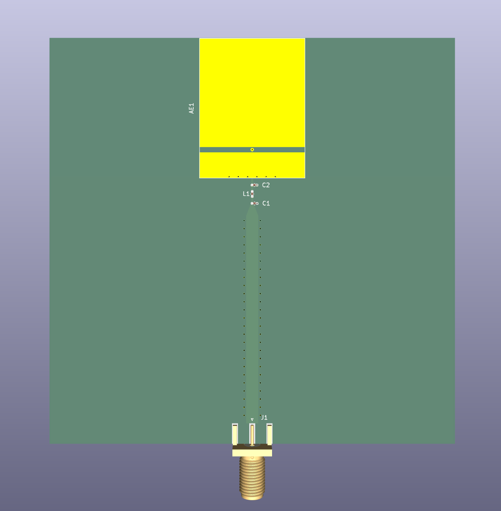
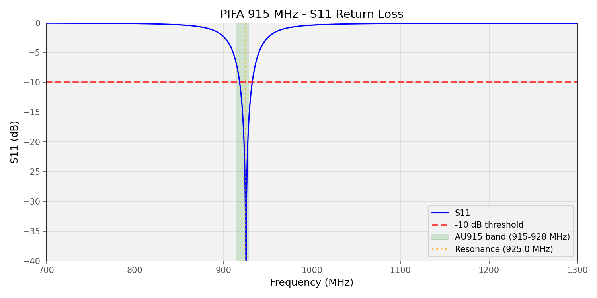
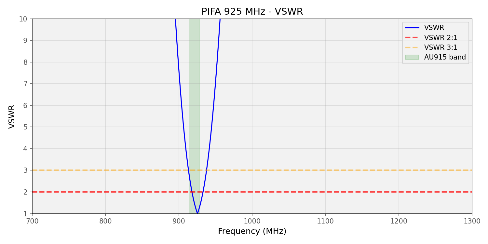
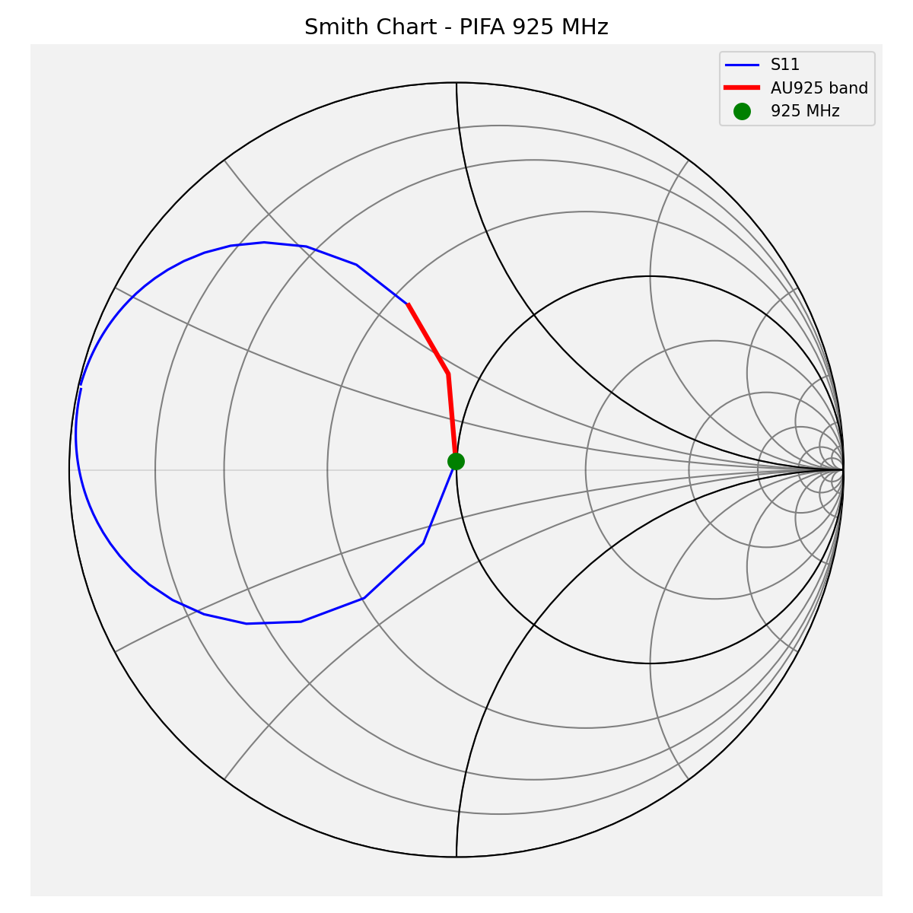
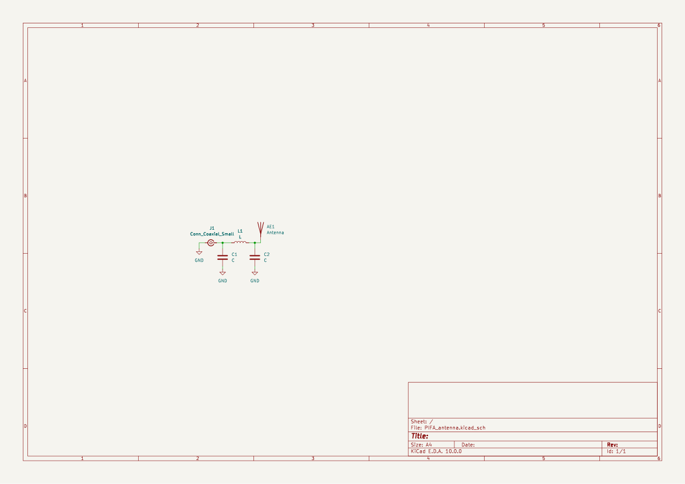

# 915 MHz Antenna Designs

A collection of PCB antenna designs for the AU915 ISM band (915-928 MHz), simulated in EMerge.

## PIFA

Shorted-patch PIFA on a 2-layer 1.6 mm FR-4 PCB.

- **Patch**: 34.42 x 26.00 mm on F.Cu, shorted to GND via 6 plated-through vias
- **Feed**: Via offset 7.00 mm from the shorted edge
- **Board**: 100 x 80 mm, full B.Cu ground plane
- **Matching**: Pi network (L1, C1, C2) between SMA and antenna feed

### Simulation Results

| Metric | Value |
|--------|-------|
| Resonance | 925.0 MHz (-33.23 dB) |
| -10 dB BW | 920 - 930 MHz (10 MHz) |
| S11 at 915 MHz | -7.09 dB |
| S11 at 926 MHz | -44.96 dB |

### Schematic

See [`915MHz_PIFA/`](915MHz_PIFA/) for the full KiCad project, EMerge simulation scripts, and verification data.
